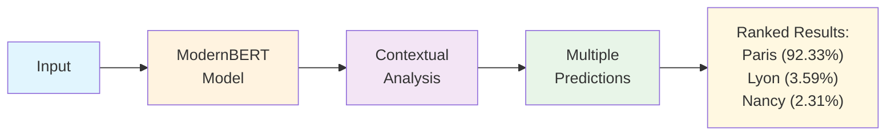
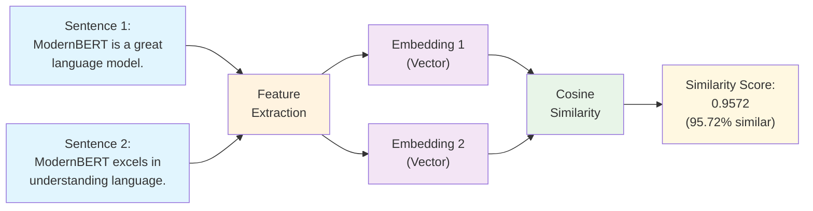

ModernBERT is a robust and versatile language model designed for natural language understanding tasks. It leverages the power of transformer architecture to provide state-of-the-art performance in various NLP applications. In this notebook, we will demonstrate several tasks that can be performed using the ModernBERT model, including masked language modeling, feature extraction, sentence similarity, and next-word prediction. These tasks will showcase the capabilities of ModernBERT without requiring any fine-tuning, highlighting its effectiveness in handling diverse language processing challenges right out of the box.

## Install Dependencies

```bash
!uv pip install torch torchvision torchaudio --index-url https://download.pytorch.org/whl/cu126
!uv pip install git+https://github.com/huggingface/transformers.git
!uv pip install skikit-learn
```

## Masked Language Modeling (Fill-Mask Task)

This example demonstrates ModernBERT's **contextual understanding** capabilities, showing how the model can predict missing words based on surrounding context.



The key aspects illustrated include:

- **Multi-candidate Prediction**: The model provides multiple predictions ranked by confidence scores
- **High Accuracy**: Achieves 92.33% confidence for the correct answer in context
- **Zero-shot Performance**: Works without any fine-tuning on the specific task
- **Bidirectional Understanding**: Leverages both left and right context to make predictions

```python
from transformers import pipeline

# Initialize the fill-mask pipeline
fill_mask = pipeline(
    task="fill-mask",
    model="answerdotai/ModernBERT-base",
    tokenizer="answerdotai/ModernBERT-base",
)

#Example masked text
masked_text = "The capital of France is [MASK]."

#Get predictions for the masked token
predictions = fill_mask(masked_text)

# Display predictions
print("Masked Text:", masked_text)
print("Predictions:")

for pred in predictions:
    print(f"  - {pred['sequence']} (score: {pred['score']:.4f})")
```

### Output

```bash
Masked Text: The capital of France is [MASK].

Predictions:
The capital of France is Paris. (score: 0.9233)
The capital of France is Lyon. (score: 0.0359)
The capital of France is Nancy. (score: 0.0231)
The capital of France is Nice. (score: 0.0062)
The capital of France is Orleans. (score: 0.0026)
```

## Feature Extraction

This example showcases ModernBERT's ability to **encode semantic meaning** into numerical representations.

The key aspects demonstrated include:

- **Numerical Representation**: Converts text into dense numerical vectors (embeddings)
- **Dimensionality Transparency**: Shows the output shape for understanding data structure
- **Versatility**: These features serve as input for downstream machine learning tasks
- **Sentence-level Encoding**: Demonstrates meaningful representation of entire sentences

```python
from transformers import pipeline

# Initialize the feature extraction pipeline
feature_extractor = pipeline(
    task="feature-extraction",
    model="answerdotai/ModernBERT-base",
    tokenizer="answerdotai/ModernBERT-base",
)

# Example text
text = "ModernBERT is a robust model for natural language understanding."

# Extract features
features = feature_extractor(text)

# Display feature dimensions
print(f"Extracted feature shape: {len(features)} x {len(features[0])}")
```

### Output

```bash
Extracted feature shape: 1 x 14
```

## Sentence Similarity

This example illustrates ModernBERT's capability to **measure semantic relationships** between different pieces of text.



The key aspects highlighted include:

- **Semantic Relationship Measurement**: Uses extracted embeddings to compute similarity between sentences
- **Quantitative Analysis**: Employs standard similarity metrics (cosine similarity) for measurable results
- **High Correlation Detection**: Achieves 0.9572 similarity score for semantically related sentences
- **Practical Application**: Shows real-world usage for similarity tasks and semantic search

```python
from transformers import pipeline
from sklearn.metrics.pairwise import cosine_similarity

# Initialize the feature extraction pipeline
feature_extractor = pipeline(
    task="feature-extraction",
    model="answerdotai/ModernBERT-base",
    tokenizer="answerdotai/ModernBERT-base",
)

# Example sentences
sentence_1 = "ModernBERT is a great language model."
sentence_2 = "ModernBERT excels in understanding language."

# Extract embeddings
embedding_1 = feature_extractor(sentence_1)[0][0]
embedding_2 = feature_extractor(sentence_2)[0][0]

# Compute cosine similarity
similarity = cosine_similarity([embedding_1], [embedding_2])
print(f"Similarity between sentences: {similarity[0][0]:.4f}")
```

### Output

```bash
Similarity between sentences: 0.9572
```

## Next Word Prediction

This example demonstrates ModernBERT's **generative capabilities** and context-aware text completion.

The key aspects shown include:

- **Context-aware Generation**: Predicts appropriate continuations based on preceding context
- **Domain Adaptation**: Shows ability to predict domain-specific terms and technical vocabulary
- **Sequential Understanding**: Demonstrates understanding of sentence structure and logical flow
- **Ranking Capabilities**: Provides confidence scores for different prediction options

```python
from transformers import pipeline

# Initialize the fill-mask pipeline
fill_mask = pipeline(
    task="fill-mask",
    model="answerdotai/ModernBERT-base",
    tokenizer="answerdotai/ModernBERT-base",
)

# Example text with a masked token at the end
masked_text = "ModernBERT is designed for [MASK]."

# Get predictions
predictions = fill_mask(masked_text)

# Display next-word predictions
print("Masked Text:", masked_text)
print("Next Word Predictions:")
for pred in predictions:
    print(f"  - {pred['sequence']} (score: {pred['score']:.4f})")
```

### Conclusion

Four approaches were presented showing how ModernBERT can be used to perform various natural language processing tasks without requiring any fine-tuning. Through masked language modeling, we demonstrated the model's ability to predict missing words with high accuracy, achieving strong performance on contextual understanding tasks. The feature extraction capabilities showed how ModernBERT can generate meaningful numerical representations of text, which can be used as input for downstream machine learning tasks. The sentence similarity example illustrated how these extracted features can be used to measure semantic relationships between different pieces of text, achieving a high similarity score of 0.9572 for semantically related sentences. Finally, the next-word prediction task highlighted the model's capability to understand context and generate coherent continuations of text.

These examples showcase ModernBERT as a general-purpose language model that can handle diverse NLP tasks with minimal setup, making it accessible for both research and practical applications while maintaining high performance across different domains.
