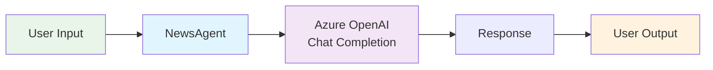
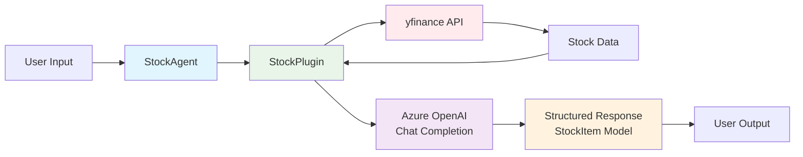
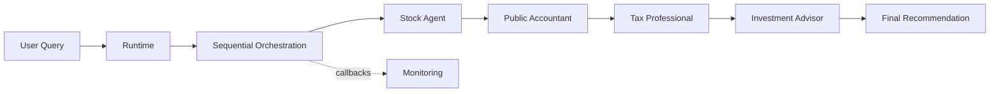

In the rapidly evolving world of AI development, Microsoft's Semantic Kernel has emerged as a powerful framework for building intelligent applications that seamlessly blend traditional programming with Large Language Model capabilities. This blog post explores four distinct examples that demonstrate the evolution from simple AI agents to sophisticated multi-agent systems, each showcasing different patterns and use cases for real-world applications.

## What is Semantic Kernel?

[Semantic Kernel](https://github.com/microsoft/semantic-kernel) is a lightweight SDK that enables developers to easily integrate Large Language Models (LLMs) into their applications using conventional programming languages. It provides a unified interface for working with different AI services, supports prompt templating and chaining, and offers advanced planning capabilities that make AI-powered applications more maintainable and scalable.

The framework's strength lies in its ability to orchestrate multiple AI agents, manage complex workflows, and provide structured interactions between humans and AI systems. Let's explore how these capabilities are demonstrated through four progressively complex examples.

## Example 1: Basic Semantic Kernel Agent

Our journey begins with the simplest possible implementation—a single ChatCompletionAgent that demonstrates the fundamental building blocks of Semantic Kernel.

### Agent Instantiation

```python
agent = ChatCompletionAgent(
    service=AzureChatCompletion(),
    name="NewsAgent",
    instructions="You are a helpful news agent that helps generate TLDR summaries of news articles.",
)
```

### Key Characteristics

- **Single Agent**: Uses one `ChatCompletionAgent` with a specific role
- **Simple Service**: Connects directly to Azure OpenAI Chat Completion
- **Basic Interaction**: Straightforward request-response pattern
- **Minimal Configuration**: Just name, instructions, and service

### Usage Pattern

The agent handles a single query and returns a response, making it perfect for:

- Simple Q&A applications
- Basic content generation tasks
- Learning the core concepts

This example establishes the foundation: every Semantic Kernel application starts with agents that have specific roles and instructions.



<p style="text-align:center"><em>Figure 1: Basic Semantic Kernel agent architecture.</em></p>

## Example 2: Plugin-Enhanced Agent

The second example elevates our capabilities by introducing plugins—custom extensions that provide domain-specific functionality to our AI agent.

### Agent Instantiation with Plugin

```python
settings = AzureChatPromptExecutionSettings()
settings.response_format = StockItem

agent = ChatCompletionAgent(
    service=AzureChatCompletion(),
    name="StockAgent",
    plugins=[StockPlugin()],
    arguments=KernelArguments(settings),
)
```

### Key Enhancements

- **Plugin Integration**: The `StockPlugin` provides real-time stock price functionality
- **Structured Response**: Uses Pydantic models (`StockItem`) for type-safe data handling
- **Execution Settings**: Configures response formatting and behavior
- **Kernel Arguments**: Passes configuration parameters to the agent

### Plugin Architecture

The `StockPlugin` demonstrates how to create reusable components:

```python
class StockPlugin:
    @kernel_function(description="Provides the stock price given a company name.")
    def get_stock_price(self, company: str) -> str:
        # Real implementation using yfinance
        return f"${current_price}"
```

### Usage Pattern

This pattern is ideal for:

- Domain-specific AI assistants
- Applications requiring real-time data integration
- Systems needing structured, type-safe responses
- Building reusable AI components

The plugin approach shows how Semantic Kernel bridges the gap between AI and traditional software development, allowing developers to create powerful, domain-specific AI tools.



<p style="text-align:center"><em>Figure 2: Plugin‑enhanced agent architecture with StockPlugin and structured responses.</em></p>

## Example 3: Multi-Agent Sequential Orchestration

This example demonstrates the power of multi-agent collaboration through sequential orchestration, where multiple specialized agents work together in a pipeline to solve complex problems.

### Agent Pipeline Architecture

```python
def get_agents() -> list[Agent]:
    return [
        stock_agent,           # Retrieves stock data
        public_accountant_agent,  # Analyzes financial implications
        tax_professional_agent,   # Evaluates tax considerations
        investment_advisor_agent, # Makes final recommendation
    ]
```

### Sequential Orchestration Setup

```python
sequential_orchestration = SequentialOrchestration(
    members=agents,
    agent_response_callback=agent_response_callback,
)

runtime = InProcessRuntime()
orchestration_result = await sequential_orchestration.invoke(
    task="Should I purchase Apple (AAPL) stock for my investment portfolio?",
    runtime=runtime,
)
```

### Key Innovations

- **Specialized Agents**: Each agent has a specific expertise domain
- **Sequential Processing**: Agents build upon previous agents' work
- **Runtime Management**: `InProcessRuntime` orchestrates the entire pipeline
- **Callback System**: Monitors and logs each agent's contribution
- **Complex Task Decomposition**: Breaks down investment decisions into specialized analyses

### Agent Specialization

1. **StockAgent**: Gathers market data and current prices
2. **PublicAccountantAgent**: Analyzes financial health and portfolio impact
3. **TaxProfessionalAgent**: Evaluates tax implications and strategies
4. **InvestmentAdvisorAgent**: Synthesizes all information for final recommendation

### Usage Pattern

This approach excels in:

- Multi-step decision-making processes
- Complex analysis requiring different expertise
- Document processing pipelines
- Any workflow where specialized knowledge is needed at each stage

The sequential orchestration pattern demonstrates how AI can mirror human collaborative processes, with each agent contributing specialized expertise to reach better outcomes.



<p style="text-align:center"><em>Figure 3: Sequential multi‑agent orchestration.</em></p>

## Example 4: Interactive Multi-Agent Chat System

The final example showcases the most sophisticated pattern: an interactive chat system with multiple agents working together to handle diverse user requests in real-time.

### Agent Architecture

```python
triage_agent = ChatCompletionAgent(
    service=AzureChatCompletion(),
    name="TriageAgent",
    instructions="Evaluate user requests and forward them to specialized agents...",
    plugins=[investment_advisor_agent, tax_professional_agent],
)
```

### Key Distinctions

- **Plugin-Based Agent Composition**: Other agents serve as plugins to the triage agent
- **Interactive Loop**: Continuous conversation with persistent chat history
- **Dynamic Routing**: Triage agent intelligently routes requests
- **Thread Management**: Maintains conversation context across interactions

### Chat Loop Implementation

```python
async def main() -> None:
    print("Welcome to the chat bot!\n  Type 'exit' to exit.")
    while True:
        user_input = input("User:> ")
        if user_input.lower().strip() == "exit":
            return

        response = await triage_agent.get_response(
            messages=user_input,
            thread=thread,
        )
        print(f"Agent :> {response}")
```

### Multi-Agent Collaboration Model

Unlike the sequential model, this approach uses:

- **Intelligent Routing**: Triage agent decides which specialist to engage
- **Parallel Capabilities**: Multiple agents available simultaneously
- **Context Preservation**: Maintains conversation history
- **Real-time Interaction**: Immediate responses to user queries

### Usage Pattern

Perfect for:

- Customer service systems
- Help desk automation
- Multi-domain support applications
- Interactive AI assistants with specialized capabilities

This pattern demonstrates how AI systems can provide human-like service experiences while maintaining the benefits of specialized expertise.

## Best Practices and Takeaways

### When to Use Each Pattern

- **Basic Agent**: Prototyping, learning, simple AI features
- **Plugin-Enhanced**: Domain-specific applications, structured data needs
- **Sequential Orchestration**: Complex analysis, multi-step workflows
- **Interactive Chat**: Customer service, continuous user interaction

## Conclusion

These four Semantic Kernel examples demonstrate the framework's versatility and power in building AI-powered applications. From simple single-agent interactions to complex multi-agent orchestrations, Semantic Kernel provides the tools and patterns needed to create sophisticated AI systems that can handle real-world complexity.

The progression from basic agents to interactive multi-agent systems shows how developers can start simple and gradually add complexity as their needs grow. Whether you're building a simple AI assistant or a complex decision-support system, Semantic Kernel's flexible architecture adapts to your requirements while maintaining code clarity and maintainability.

As AI continues to evolve, frameworks like Semantic Kernel will play crucial roles in making advanced AI capabilities accessible to developers, enabling the creation of more intelligent, helpful, and sophisticated applications that can truly augment human capabilities.
