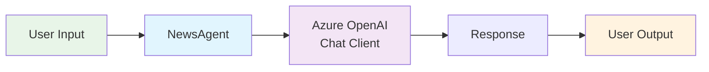
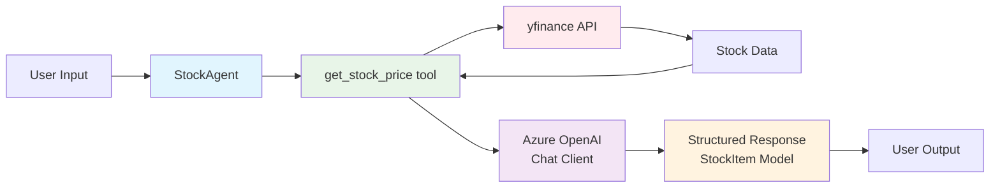
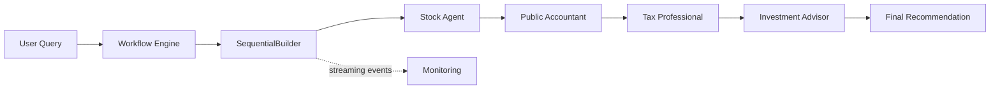

In the rapidly evolving world of AI development, Microsoft's Agent Framework has emerged as a powerful framework for building intelligent applications that seamlessly blend traditional programming with Large Language Model capabilities. As the unified successor to Semantic Kernel and AutoGen, it brings together enterprise-grade reliability with rich multi-agent orchestration. This blog post explores four distinct examples that demonstrate the evolution from simple AI agents to sophisticated multi-agent systems, each showcasing different patterns and use cases for real-world applications.

## What is Microsoft Agent Framework?

[Microsoft Agent Framework](https://github.com/microsoft/agent-framework) is an open-source SDK that enables developers to easily build, orchestrate, and deploy AI agents and multi-agent workflows using conventional programming languages. It unifies the production-tested patterns from Semantic Kernel with the multi-agent research patterns from AutoGen, providing a single, cohesive API for working with different AI services, tools, and workflows.

The framework's strength lies in its ability to orchestrate multiple AI agents, manage complex graph-based workflows, and provide structured interactions between humans and AI systems. Let's explore how these capabilities are demonstrated through four progressively complex examples.

## Example 1: Basic Chat Agent

Our journey begins with the simplest possible implementation—a single `ChatAgent` that demonstrates the fundamental building blocks of the Agent Framework.

### Agent Instantiation

```python
from agent_framework import ChatAgent
from agent_framework.azure import AzureOpenAIChatClient

agent = ChatAgent(
    chat_client=AzureOpenAIChatClient(),
    name="NewsAgent",
    instructions="You are a helpful news agent that helps generate TLDR summaries of news articles.",
)
```

### Key Characteristics

- **Single Agent**: Uses one `ChatAgent` with a specific role
- **Simple Client**: Connects directly to Azure OpenAI via `AzureOpenAIChatClient`
- **Basic Interaction**: Straightforward request-response pattern
- **Minimal Configuration**: Just a name, instructions, and a chat client

### Usage Pattern

The agent handles a single query and returns a response, making it perfect for:

- Simple Q&A applications
- Basic content generation tasks
- Learning the core concepts

This example establishes the foundation: every Agent Framework application starts with agents that have specific roles and instructions.



<p style="text-align:center"><em>Figure 1: Basic Agent Framework architecture.</em></p>

## Example 2: Tool-Enhanced Agent

The second example elevates our capabilities by introducing tools—custom Python functions that provide domain-specific functionality to our AI agent.

### Agent Instantiation with Tools

```python
from agent_framework import ChatAgent
from agent_framework.azure import AzureOpenAIChatClient
from pydantic import BaseModel

class StockItem(BaseModel):
    company: str
    symbol: str
    price: float

agent = ChatAgent(
    chat_client=AzureOpenAIChatClient(),
    name="StockAgent",
    instructions="You are a helpful stock agent. Use tools to fetch live data.",
    tools=[get_stock_price],
    response_format=StockItem,
)
```

### Key Enhancements

- **Tool Integration**: Plain Python functions become callable tools for the model
- **Structured Response**: Uses Pydantic models (`StockItem`) for type-safe data handling
- **Response Format**: Constrains the model output to a validated schema
- **Composable**: Tools are just functions, so they're trivial to reuse and test

### Tool Definition

Tools in Agent Framework are regular Python functions, optionally annotated for clearer schemas:

```python
from typing import Annotated
from pydantic import Field
import yfinance as yf

def get_stock_price(
    company: Annotated[str, Field(description="The company ticker, e.g. AAPL")]
) -> str:
    """Provides the stock price given a company ticker."""
    current_price = yf.Ticker(company).fast_info["last_price"]
    return f"${current_price}"
```

### Usage Pattern

This pattern is ideal for:

- Domain-specific AI assistants
- Applications requiring real-time data integration
- Systems needing structured, type-safe responses
- Building reusable AI components

The tool approach shows how Agent Framework bridges the gap between AI and traditional software development, allowing developers to create powerful, domain-specific AI assistants from ordinary Python code.



<p style="text-align:center"><em>Figure 2: Tool‑enhanced agent architecture with a stock-price tool and structured responses.</em></p>

## Example 3: Multi-Agent Sequential Workflow

This example demonstrates the power of multi-agent collaboration through a sequential workflow, where multiple specialized agents work together in a pipeline to solve complex problems.

### Agent Pipeline Architecture

```python
agents = [
    stock_agent,              # Retrieves stock data
    public_accountant_agent,  # Analyzes financial implications
    tax_professional_agent,   # Evaluates tax considerations
    investment_advisor_agent, # Makes final recommendation
]
```

### Sequential Workflow Setup

```python
from agent_framework import SequentialBuilder

workflow = SequentialBuilder().participants(agents).build()

async for event in workflow.run_stream(
    "Should I purchase Apple (AAPL) stock for my investment portfolio?"
):
    print(event)
```

### Key Innovations

- **Specialized Agents**: Each agent has a specific expertise domain
- **Sequential Processing**: Agents build upon previous agents' work via a shared conversation
- **Workflow Engine**: `SequentialBuilder` composes the pipeline as a typed workflow graph
- **Streaming Events**: Monitor and log each agent's contribution in real time
- **Complex Task Decomposition**: Breaks down investment decisions into specialized analyses

### Agent Specialization

1. **StockAgent**: Gathers market data and current prices
2. **PublicAccountantAgent**: Analyzes financial health and portfolio impact
3. **TaxProfessionalAgent**: Evaluates tax implications and strategies
4. **InvestmentAdvisorAgent**: Synthesizes all information for final recommendation

### Usage Pattern

This approach excels in:

- Multi-step decision-making processes
- Complex analysis requiring different expertise
- Document processing pipelines
- Any workflow where specialized knowledge is needed at each stage

The sequential workflow pattern demonstrates how AI can mirror human collaborative processes, with each agent contributing specialized expertise to reach better outcomes. For fan-out / fan-in patterns, swap `SequentialBuilder` for `ConcurrentBuilder`, or compose arbitrary graphs with `WorkflowBuilder`.



<p style="text-align:center"><em>Figure 3: Sequential multi‑agent workflow.</em></p>

## Example 4: Interactive Multi-Agent Chat System

The final example showcases the most sophisticated pattern: an interactive chat system with multiple agents working together to handle diverse user requests in real-time.

### Agent Architecture

In Agent Framework, agents can be exposed to other agents as tools — turning a "triage" agent into a router that delegates to specialists.

```python
triage_agent = ChatAgent(
    chat_client=AzureOpenAIChatClient(),
    name="TriageAgent",
    instructions="Evaluate user requests and forward them to specialized agents...",
    tools=[
        investment_advisor_agent.as_tool(
            name="investment_advisor",
            description="Answer investment questions",
        ),
        tax_professional_agent.as_tool(
            name="tax_professional",
            description="Answer tax-related questions",
        ),
    ],
)
```

### Key Distinctions

- **Agents-as-Tools**: Specialist agents are exposed as callable tools on the triage agent
- **Interactive Loop**: Continuous conversation with a persistent thread
- **Dynamic Routing**: Triage agent intelligently routes requests to the right specialist
- **Thread Management**: `AgentThread` maintains conversation context across turns

### Chat Loop Implementation

```python
async def main() -> None:
    print("Welcome to the chat bot!\n  Type 'exit' to exit.")
    thread = triage_agent.get_new_thread()
    while True:
        user_input = input("User:> ")
        if user_input.lower().strip() == "exit":
            return

        response = await triage_agent.run(user_input, thread=thread)
        print(f"Agent :> {response}")
```

### Multi-Agent Collaboration Model

Unlike the sequential model, this approach uses:

- **Intelligent Routing**: Triage agent decides which specialist to engage
- **Parallel Capabilities**: Multiple agents available simultaneously
- **Context Preservation**: `AgentThread` maintains conversation history
- **Real-time Interaction**: Immediate responses to user queries

For richer routing semantics, Agent Framework also supports an explicit **handoff** pattern, where control of the conversation is transferred between agents rather than nested as tool calls.

### Usage Pattern

Perfect for:

- Customer service systems
- Help desk automation
- Multi-domain support applications
- Interactive AI assistants with specialized capabilities

This pattern demonstrates how AI systems can provide human-like service experiences while maintaining the benefits of specialized expertise.

## Best Practices and Takeaways

### When to Use Each Pattern

- **Basic Agent**: Prototyping, learning, simple AI features
- **Tool-Enhanced**: Domain-specific applications, structured data needs
- **Sequential Workflow**: Complex analysis, multi-step pipelines
- **Interactive Chat / Handoff**: Customer service, continuous user interaction across domains

### Migrating from Semantic Kernel

If you're coming from Semantic Kernel, the mental model carries over cleanly:

- `ChatCompletionAgent` → `ChatAgent`
- `AzureChatCompletion` service → `AzureOpenAIChatClient`
- `plugins=[...]` of `@kernel_function` classes → `tools=[...]` of plain Python functions
- `SequentialOrchestration` + `InProcessRuntime` → `SequentialBuilder().participants(...).build()`
- `agent.get_response(..., thread=...)` → `agent.run(..., thread=...)`

## Conclusion

These four Agent Framework examples demonstrate the framework's versatility and power in building AI-powered applications. From simple single-agent interactions to complex multi-agent workflows, Microsoft Agent Framework provides the tools and patterns needed to create sophisticated AI systems that can handle real-world complexity.

The progression from basic agents to interactive multi-agent systems shows how developers can start simple and gradually add complexity as their needs grow. Whether you're building a simple AI assistant or a complex decision-support system, Agent Framework's flexible architecture — combining the production focus of Semantic Kernel with the orchestration depth of AutoGen — adapts to your requirements while keeping code clear and maintainable.

As AI continues to evolve, unified frameworks like Microsoft Agent Framework will play crucial roles in making advanced agentic capabilities accessible to developers, enabling the creation of more intelligent, helpful, and sophisticated applications that can truly augment human capabilities.
